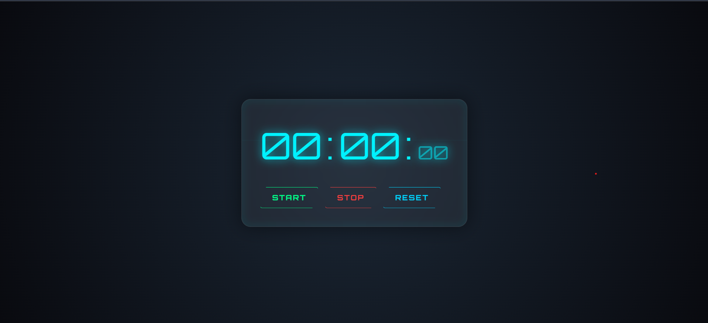

# 🛸 Chronos-OS: Futuristic React Stopwatch

A high-precision, cyber-themed stopwatch built with **React** and **Vite**. This project features a sleek "Glassmorphic" interface, neon glows, and a scanline effect for a command-center aesthetic.

## 🚀 Features

- **Sub-millisecond Precision:** Uses `Date.now()` logic and `useRef` to prevent time-drift, ensuring the timer stays accurate regardless of React's re-render cycles.
- **Futuristic UI Design:**
  - **Glassmorphism:** Semi-transparent panels with `backdrop-filter` blur.
  - **Neon Aesthetics:** Color-coded glowing buttons with custom box-shadows.
  - **Scanline Overlay:** An animated CSS layer that mimics a retro-tech monitor.
  - **Geometric Shapes:** Skewed button designs using CSS `clip-path`.
- **Fully Responsive:** Designed to look great on various screen sizes.

---

## 🛠️ Tech Stack

- **Framework:** [React 18](https://reactjs.org/)
- **Build Tool:** [Vite](https://vitejs.dev/)
- **Styling:** CSS3 (Flexbox, Animations, Glassmorphism)
- **Typography:** Orbitron & Share Tech Mono via Google Fonts

---

## 📦 Installation & Setup

Follow these steps to get the project running on your local machine:

1. **Clone the repository:**
   ```bash
   git clone https://github.com/DulanDhanush/stop-watch-react-.git
   cd stop-watch-react-
   ```
2. Install dependencies:

```bash
    npm install
```

3. Start the development server:

```bash
    npm run dev
```

4. Build for production:

```bash
   npm run build
```

---

## 📂 Project Structure

```bash
src/
├── App.jsx # Parent component
├── Stopwatch.jsx # Core logic and timer display
├── App.css # Futuristic styles, neon effects & animations
└── main.jsx # Vite entry point
```

---

## 🎮 How to Use

- START: Initiates the timer. If the timer was paused, it resumes exactly where it left off.

- STOP: Freezes the timer.

- RESET: Returns the timer to 00:00:00 and stops all background intervals.

---

## 🎨 Design Customization

You can easily change the "Power Color" of the stopwatch by editing the CSS variables in App.css:

```bash
/* Change the primary glow color */
:root {
  --neon-cyan: #00f2ff;
  --neon-green: #00ff88;
  --neon-red: #ff3e3e;
}
```

---

## 🛠️ Future Roadmap

- [ ] Lap Functionality: Ability to record and display split times.

- [ ] Sound FX: Audio cues for start, stop, and reset actions.

- [ ] Theme Switcher: Toggle between Cyan (Default), Amber (Retro), and Crimson (Alert) themes.

## Built with ⚡ and React.

## Preview


